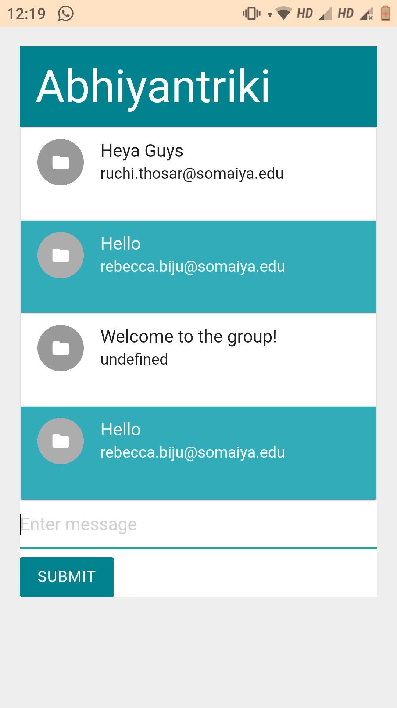
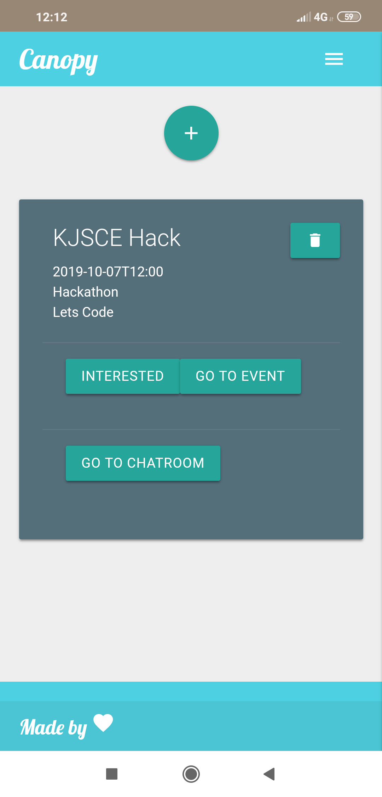
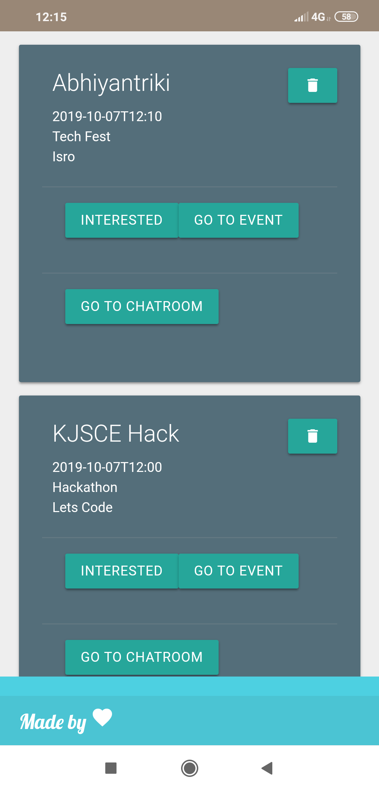
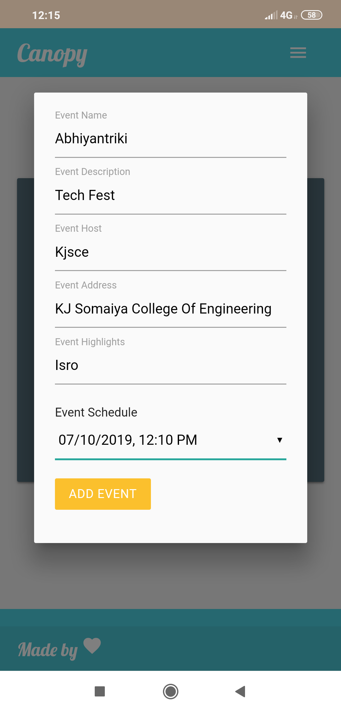
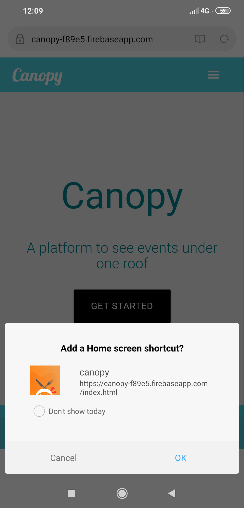

<h2 align="center">Canopy</h2>

<h3 align="center">All local small events under one roof</h3>

<h5 align="center">https://canopy-f89e5.firebaseapp.com/</h5>

------------------------------------------

<div align="center">
Generally people tend to watch or enjoy events with friends or other people, but mostly people end up watching a event at their place alone. Canopy provides such people a platform to communicate with close by people and also look for events around their location. Thus, it becomes one roof for all local events.
</div>


------------------------------------------
### Features

- `Progressive Web Application`:
    - No need to download the app from playstore, just a url and you're off to go.
    - Offline support by cache mechanisms.
- `View or host any local, small, unofficial events` around you.
- `Promoting` Local vendors
- `Chatroom` for each event
- `Filteration` of events to avoid Spam 
- `Gamification` rewarding users and hosts points and coupons based on tweets and popularity of the event.

------------------------------------------
### Installation

``` sh
- git clone https://github.com/greevashah/canopy
```
------------------------------------------
### Demo
<div align="center">

<h3 > Screenshots </h3>
<br>
<br>
<br>
<br>
<br>
<br>

</div>
------------------------------------------
### Contributing

 We're are open to `enhancements` & `bug-fixes` :smile:  

### Note

- This project was done under `24 hours with minimal pre-preparation` as a part of KJSCE Hackathon 2019, K.J. Somaiya College of Engineering, Mumbai.

------------------------------------------
### Contributors

- [@shivam1708](https://github.com/shivam1708)
- [@greevashah](https://github.com/greevashah)
- [@beccaboo-31](https://github.com/beccaboo-31)
- [@thosarruchi](https://github.com/thosarruchi)

-------------------------------------------
### Recognition
- This repository / project was a part of KJSCE Hackathon 2019.
